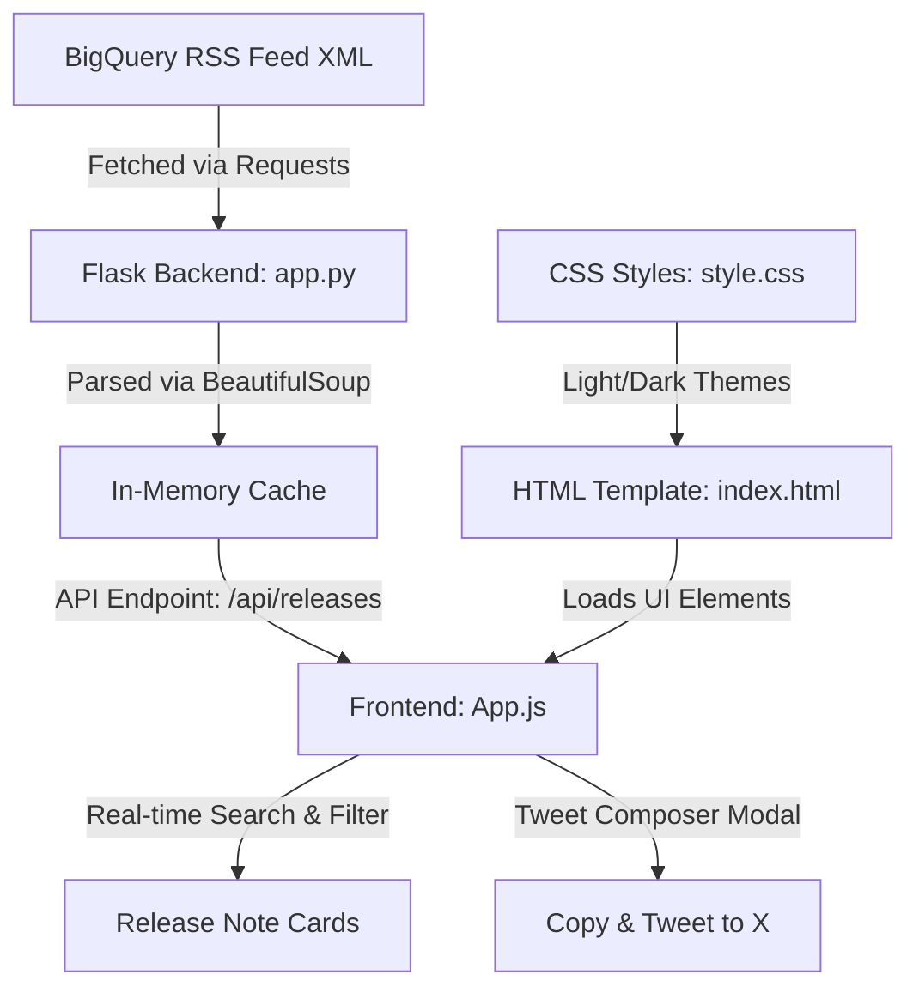

# BigQuery Release Notes Explorer 🚀

A high-fidelity, responsive web dashboard built with **Python Flask** and vanilla **HTML, CSS, and JavaScript**. This application parses, structures, and displays the official BigQuery Release Notes feed, providing a modern dashboard experience to filter releases and easily tweet specific updates.

---

## 🎨 Key Features

* **Rich UI & Dual Themes**: Beautiful glassmorphic UI built around Google Cloud aesthetics. Seamless toggle between custom dark and light modes (persisted in `localStorage`).
* **Live Stats Dashboard**: Real-time counter detailing total updates, features added, issue alerts, and the last synchronization time.
* **Granular Release Cards**: Rather than showing massive, hard-to-read daily logs, the backend splits daily entries into individual, category-tagged cards (e.g., *Feature, Issue, Resolved, Deprecated*).
* **Power Search & Sorting**:
  * **Keyword Search**: Instant type-ahead filtering of card text, dates, or tags.
  * **Interactive Tags**: Filter chips generated dynamically based on categories found in the XML feed.
  * **Date Sorting**: Instantly toggle ordering between newest first and oldest first.
* **Interactive Tweet Composer**:
  * Click **Tweet** on any card to open a custom composer modal.
  * **Real-time Character Counter**: Visually guides your character budget (280-char X limit).
  * **Smart Truncate**: With one click, the system shrinks the update body text automatically so that tags, dates, and documentation links fit within 280 characters without breaking.
  * **Clipboard Copy & Posting**: Direct integration with X's post intent or quick clipboard copy with active feedback states.

---

## 🏗️ Architecture



---

## 📂 Project Structure

```text
bq-releases-notes/
│
├── app.py                 # Flask server (routes, XML fetching, BeautifulSoup parser)
├── requirements.txt       # Python dependency definitions
├── .gitignore             # Git ignore file (cache, virtual envs, OS metadata)
├── README.md              # Project documentation (this file)
│
├── templates/
│   └── index.html         # Application layout and modal interfaces
│
└── static/
    ├── css/
    │   └── style.css      # CSS variables, themes, transitions, animations
    └── js/
        └── app.js         # Client-side state manager, filters, and composer logic
```

---

## 🚀 Quick Start

### 1. Clone the repository
Navigate into the directory:
```bash
cd bq-releases-notes
```

### 2. Install dependencies
Ensure Python is installed, then run:
```bash
pip install -r requirements.txt
```

### 3. Run the development server
Start the Flask app:
```bash
python app.py
```

### 4. Visit the web app
Open your browser and navigate to:
```text
http://127.0.0.1:5000
```

---

## ⚙️ Backend Details

The application fetches data from Google's official XML feed:
`https://docs.cloud.google.com/feeds/bigquery-release-notes.xml`

### Parser Logic (`app.py`)
1. Fetches the Atom feed and uses `BeautifulSoup` to load XML tags.
2. For each `<entry>`, it extracts the date (title), updated timestamp, and alternate documentation links.
3. It breaks apart the CDATA `<content>` payload by scanning for `<h3>` tags.
4. Siblings following each `<h3>` (paragraphs, code blocks, lists) are grouped together to represent distinct releases, which are packed and sent as structured JSON to the frontend.
5. In-memory caching stores the feed data for **5 minutes** (300s) to avoid rate limits and optimize page load speeds.